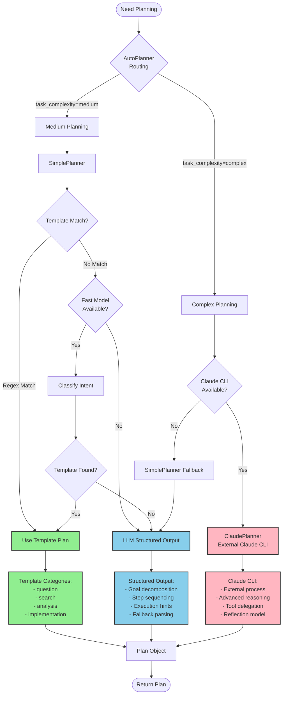
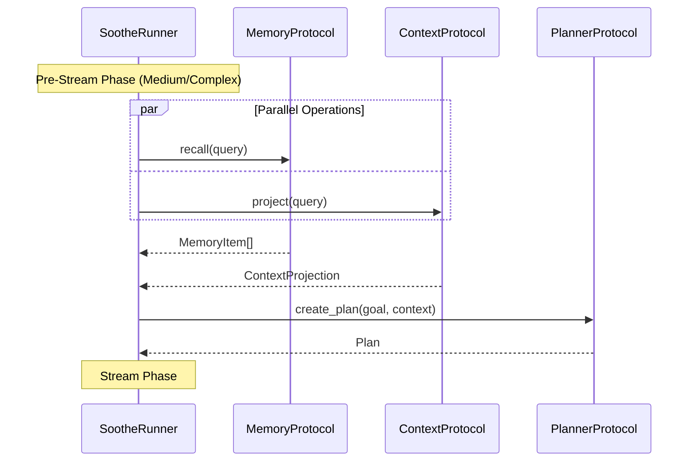
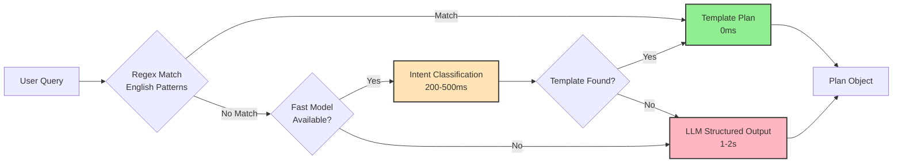

# RFC-0008: Request Processing Workflow and Performance Optimization

**RFC**: 0008
**Title**: Request Processing Workflow and Performance Optimization
**Status**: Draft
**Created**: 2026-03-16
**Updated**: 2026-03-19
**Related**: RFC-0001, RFC-0002, RFC-0003, RFC-0007, RFC-0009, RFC-0012

## Abstract

This RFC defines the architecture for Soothe's request processing workflow and establishes a framework for performance optimization. It specifies a unified classification system (RFC-0012) that drives adaptive processing across three complexity levels (chitchat, medium, complex), enabling sub-second responses for simple queries while maintaining full protocol capabilities for complex tasks.

## Motivation

RFC-0003 defines the CLI/TUI architecture and event streaming model. RFC-0007 adds autonomous iteration. RFC-0012 introduces unified LLM-based classification. However, no RFC addresses how to optimize request processing based on query complexity.

### Problem Statement

Before this RFC, all queries received uniform heavyweight processing:
- **Memory recall** (1-2s): Semantic search over conversation history
- **Context projection** (0.5-1s): Token-budget allocation from context store
- **Plan creation** (2-3s): LLM-based planning via structured output

For chitchat queries (e.g., "hello", "how are you?"), these operations wasted 4-5 seconds while providing no value. This created poor user experience for interactive use cases.

### Design Goals

1. **Sub-second response for chitchat**: Greetings, simple questions, short queries (< 30 tokens)
2. **Efficient processing for medium tasks**: Multi-step tasks, debugging, code review
3. **Full processing for complex tasks**: Architecture decisions, migrations, large refactoring
4. **No quality regression**: Complex tasks must retain full protocol capabilities
5. **Observable and configurable**: Performance metrics and feature flags for gradual rollout

## Design Principles

### 1. Unified Classification-Driven Routing (RFC-0012)

The system uses a single LLM classification call to determine `task_complexity`:

- **Chitchat**: Greetings, simple questions, short queries (< 30 tokens) → Direct LLM, no planning, no state
- **Medium**: Multi-step tasks, debugging, code review (90% of tasks) → Template or LLM planning
- **Complex**: Architecture design, migrations, large refactoring (10% of tasks) → Claude subagent or LLM planning

### 2. Lazy Resource Loading

Resources are loaded only when needed:
- Memory recall triggered only for medium/complex queries
- Context projection deferred until complexity warrants it
- Planning uses templates for common patterns, LLM only when necessary

### 3. Parallel Execution

Independent operations execute concurrently:
- Memory recall and context projection run in parallel
- Async I/O maximized throughout the pipeline
- DAG-based step execution for parallel steps (RFC-0009)

### 4. Graceful Degradation

System remains functional even if optimization components fail:
- Classification failures default to "medium" (safe middle ground)
- Template misses fall back to LLM planning
- Planner unavailability falls back to direct execution

## Request Processing Workflow

### High-Level Flow Diagram

```mermaid
flowchart TD
    Start([User Request]) --> Input[Input Processing]
    Input --> |Validate & Route| Runner[SootheRunner.astream]

    Runner --> Classify{Unified Classification<br/>RFC-0012}

    %% Chitchat Fast Path
    Classify -->|chitchat<br/>< 30 tokens| Fast[Chitchat Fast Path]
    Fast --> DirectLLM[Direct LLM Call]
    DirectLLM --> Response[Response]
    Response --> End1([End - No State])

    %% Normal Flow
    Classify -->|medium/complex| Normal[Normal Processing]
    Normal --> PreStream[Pre-Stream Phase]

    PreStream --> Thread[Thread Management]
    Thread --> ParallelOps{Complexity Check}
    ParallelOps -->|medium/complex| Parallel[Memory + Context<br/>Parallel Execution]
    ParallelOps -->|disabled| SkipMem[Skip Memory/Context]

    Parallel --> Planning[Planning Phase]
    SkipMem --> Planning

    Planning --> AutoPlanner{AutoPlanner Routing}
    AutoPlanner -->|medium| SimplePlanner[SimplePlanner<br/>Template or LLM]
    AutoPlanner -->|complex| ClaudePlanner[ClaudePlanner<br/>Claude CLI]

    SimplePlanner --> PlanReady[Plan Created]
    ClaudePlanner --> PlanReady

    PlanReady --> ExecCheck{Plan-Only Mode?}
    ExecCheck -->|Yes| ReturnPlan[Return Plan]
    ExecCheck -->|No| StepCheck{Multiple Steps?}

    StepCheck -->|Yes| StepLoop[Step Scheduler<br/>RFC-0009]
    StepCheck -->|No| Stream[Stream Phase]

    StepLoop --> DAG[DAG Analysis]
    DAG --> ParallelSteps{Independent Steps?}
    ParallelSteps -->|Yes| ParallelExec[Parallel Execution]
    ParallelSteps -->|No| SequentialExec[Sequential Execution]

    ParallelExec --> Stream
    SequentialExec --> Stream

    Stream --> LangGraph[LangGraph Agent]
    LangGraph --> PostStream[Post-Stream Phase]

    PostStream --> Persist[Persist State]
    Persist --> Reflect[Reflection]
    Reflect --> End2([End])

    ReturnPlan --> End2

    %% Styling
    classDef fastPath fill:#90EE90,stroke:#333,stroke-width:3px
    classDef planning fill:#87CEEB,stroke:#333,stroke-width:2px
    classDef execution fill:#FFB6C1,stroke:#333,stroke-width:2px
    classDef storage fill:#DDA0DD,stroke:#333,stroke-width:2px

    class Fast,DirectLLM,Response fastPath
    class AutoPlanner,SimplePlanner,ClaudePlanner planning
    class LangGraph,StepLoop,ParallelExec execution
    class Parallel,Persist storage
```



### Phase Breakdown

#### Phase 0: Classification (RFC-0012)

**Purpose**: Determine query complexity to optimize processing path.

**Implementation**: Unified LLM-based classification with token-count fallback.

**Outputs**:
- `task_complexity`: `Literal["chitchat", "medium", "complex"]`
- `is_plan_only`: Whether user wants planning without execution
- `reasoning`: Brief explanation

**Latency**: < 100ms (fast model structured output)

**Routing Logic**:
- Chitchat → Fast path (skip all protocols)
- Medium → Normal flow with memory/context/planning
- Complex → Normal flow with full stack

#### Phase 1: Pre-Stream

**Purpose**: Prepare context and plan before LangGraph execution.

**Operations** (conditional based on complexity):

| Operation | Chitchat | Medium | Complex | Duration |
|-----------|----------|--------|---------|----------|
| Thread Management | ❌ Skip | ✅ Create/Resume | ✅ Create/Resume | ~12ms |
| Policy Check | ❌ Skip | ✅ Check | ✅ Check | ~10ms |
| Memory Recall | ❌ Skip | ✅ Parallel | ✅ Parallel | 1-2s |
| Context Projection | ❌ Skip | ✅ Parallel | ✅ Parallel | 0.5-1s |
| Plan Creation | ❌ Skip | ✅ Template/LLM | ✅ LLM/Claude | 0-3s |

**Total Latency**:
- Chitchat: 0ms (skipped entirely)
- Medium: 1.5-3s (with parallelization)
- Complex: 1.5-4s (with parallelization)

#### Phase 2: Stream

**Purpose**: Execute the plan via LangGraph agent with HITL support.

**Sub-phases**:

1. **Step Scheduling** (RFC-0009, multi-step plans only):
   - Analyze DAG dependencies
   - Execute independent steps in parallel
   - Sequential execution for dependent steps

2. **LangGraph Execution**:
   - Invoke agent with enriched messages
   - Handle HITL interrupts with auto-approval
   - Stream response chunks

**Latency**: Varies by query complexity and plan size.

#### Phase 3: Post-Stream

**Purpose**: Persist state and reflect on execution.

**Operations**:

| Operation | Chitchat | Medium | Complex | Duration |
|-----------|----------|--------|---------|----------|
| Context Ingestion | ❌ Skip | ✅ Store | ✅ Store | ~10ms |
| Memory Storage | ❌ Skip | ✅ Store | ✅ Store | ~50ms |
| Plan Reflection | ❌ Skip | ✅ Heuristic | ✅ LLM-assisted | 0-500ms |
| Checkpoint Save | ❌ Skip | ✅ Save | ✅ Save | ~20ms |

**Total Latency**: < 100ms for medium/complex, 0ms for chitchat.

## Planning Architecture

### Planning Workflow Diagram



### Planner Backends

#### AutoPlanner (Router)

**Purpose**: Route to best planner based on unified classification.

**Routing Logic**:
- `task_complexity == "complex"` → ClaudePlanner (if available) → SimplePlanner (fallback)
- `task_complexity == "medium"` → SimplePlanner
- `task_complexity == "chitchat"` → None (handled before planning)

#### SimplePlanner

**Optimizations**:
1. **Template Matching**: Zero-cost regex patterns for common queries
2. **Intent Classification**: Fast-model LLM for non-English queries
3. **Structured Output**: Single LLM call with Plan schema
4. **Fallback Parsing**: Manual JSON extraction from raw responses

**Template Categories**:
- **Question**: Single-step direct response
- **Search**: Multi-step search → synthesize
- **Analysis**: Multi-step analyze → insights
- **Implementation**: Multi-step understand → implement → test

**Latency**:
- Template match: 0ms
- Intent classification: 200-500ms
- LLM structured output: 1-2s

#### ClaudePlanner

**Capabilities**:
- External Claude CLI process for advanced reasoning
- Better performance on complex architectural decisions
- Tool delegation and file system access
- Reflection model for plan validation

**Latency**: 2-4s (external process overhead)

### Plan Execution (RFC-0009)

**Step Scheduler**:
- DAG-based dependency analysis
- Parallel execution for independent steps
- Concurrency control via `ConcurrencyController`
- Hierarchical limits (LLM calls, tool calls, parallel steps)

**Execution Flow**:
1. Parse plan into DAG
2. Identify ready steps (dependencies satisfied)
3. Execute ready steps in parallel (up to concurrency limit)
4. Update step status and results
5. Repeat until all steps complete

## Performance Optimization Strategies

### Adaptive Processing Matrix

| Complexity | Memory | Context | Planning | Target Latency |
|------------|--------|---------|----------|----------------|
| Chitchat | ❌ Skip | ❌ Skip | ❌ Skip | < 1s |
| Medium | ✅ Parallel | ✅ Parallel | Template/LLM | < 2s |
| Complex | ✅ Parallel | ✅ Parallel | LLM/Claude | < 4s |

### Parallel Execution Strategy



**Savings**: Overlaps 1-2s of I/O-bound work, saving 500ms-1.5s.

### Template Matching Strategy

**Pattern Matching Flow**:



**Template Savings**: 1.5-2.5s for matched queries (no LLM call).

### Reflection Optimization

**Heuristic Reflection** (Medium queries):
- No LLM call needed
- Dependency-aware failure categorization
- Blocked step detection
- Goal directive generation for prerequisite failures

**LLM-Assisted Reflection** (Complex queries):
- Deep failure analysis
- Structured feedback generation
- Complex goal directives
- Falls back to heuristic on error

## Performance Metrics

### Latency SLAs by Complexity

| Complexity | P50 | P90 | P99 | Notes |
|------------|-----|-----|-----|-------|
| Chitchat | 300ms | 500ms | 800ms | Direct LLM, no overhead |
| Medium | 1.5s | 2s | 3s | Parallel memory/context + template/LLM |
| Complex | 2.5s | 4s | 6s | Full stack with Claude or LLM planning |

### Quality Targets

- **No regression** in response quality for complex queries
- Template plan acceptance rate > 95% for matched queries
- Classification accuracy > 90% across all complexity levels
- Parallel execution correctness > 99.9%

### Observable Metrics

**Performance Counters**:
- Pre-stream duration by complexity
- Planning duration by backend (template/intent/LLM/Claude)
- Memory recall duration
- Context projection duration
- Post-stream duration

**Distribution Metrics**:
- Complexity distribution (chitchat/medium/complex)
- Planner backend distribution (template/LLM/Claude)
- Template hit rate by category
- Parallel execution savings

**Quality Metrics**:
- Classification accuracy (when ground truth available)
- Plan revision rate (indicates planning quality)
- Step failure rate by complexity

## Configuration

### Performance Feature Flags

```yaml
performance:
  enabled: true
  unified_classification: true        # RFC-0012: LLM-based classification
  classification_mode: "llm"          # "llm", "fallback", "disabled"

  conditional_memory_recall: true     # Skip for chitchat
  conditional_context_projection: true # Skip for chitchat
  parallel_pre_stream: true           # Parallel memory + context
  template_planning: true             # Template matching in SimplePlanner

  # Thresholds (token count fallback)
  thresholds:
    medium_threshold: 30              # < 30 tokens → chitchat
    complex_threshold: 160            # >= 160 tokens → complex
    use_tiktoken: true                # Use tiktoken for token counting
```

### Planner Configuration

```yaml
protocols:
  planner:
    routing: "auto"                   # "auto", "always_direct", "always_claude"
    planner_model: "think"            # Model role for planning
```

### System Prompt Optimization

```yaml
performance:
  optimize_system_prompts: true       # Use task_complexity for prompt selection
```

**Prompt Selection**:
- Chitchat → Minimal prompt (helpful assistant)
- Medium → Medium prompt (with guidelines)
- Complex → Full prompt (all context)

## Security Considerations

- **Classification isolation**: Must not leak sensitive information between threads
- **Template security**: Patterns must not expose internal system state
- **Parallel execution**: Data isolation maintained across concurrent operations
- **Performance logging**: Must not log sensitive query content
- **Cache security**: Embedding cache must respect thread isolation

## Failure Modes and Mitigation

| Failure | Mitigation | Impact |
|---------|-----------|--------|
| Classifier error | Default to "medium" | Slightly higher latency |
| Fast model unavailable | Token-count fallback | No impact (automatic) |
| Template mismatch | LLM planning | 1-2s additional latency |
| Claude CLI unavailable | SimplePlanner fallback | Different planning quality |
| Parallel task failure | Partial results, continue | Some context missing |
| Memory recall timeout | Skip memory, continue | No historical context |
| Context projection error | Skip context, continue | Less enriched input |

## Implementation Status

### Completed (RFC-0012)

- ✅ Unified classification system with `task_complexity`
- ✅ Chitchat fast path (direct LLM, no state)
- ✅ AutoPlanner routing by complexity
- ✅ System prompt optimization by complexity
- ✅ Template matching in SimplePlanner
- ✅ Parallel memory + context execution
- ✅ Removed SubagentPlanner (simplified architecture)

### Future Enhancements

1. **Predictive caching**: Pre-load resources for predicted next queries
2. **Streaming context**: Project context incrementally during stream phase
3. **Dynamic thresholds**: Adjust complexity thresholds based on usage patterns
4. **ML-based classification**: Replace heuristics with lightweight classifier
5. **Cost-quality tradeoffs**: Measure quality impact of optimizations

## References

- RFC-0001: Core architecture principles
- RFC-0002: Protocol interfaces
- RFC-0003: CLI/TUI architecture
- RFC-0007: Autonomous iteration loop
- RFC-0009: DAG-Based Execution and Unified Concurrency
- RFC-0012: Unified LLM-Based Classification System

## Appendix: Complexity Classification Examples

### Chitchat Examples

```
"hi"                          → chitchat (greeting, 1 token)
"thanks"                      → chitchat (acknowledgment, 1 token)
"who are you?"                → chitchat (simple question, 3 tokens)
"what time is it?"            → chitchat (simple question, 4 tokens)
"how are you doing?"          → chitchat (greeting, 4 tokens)
```

**Characteristics**: < 30 tokens, greetings, simple questions, acknowledgments

### Medium Examples

```
"implement a function to parse JSON"  → medium (multi-step, clear scope)
"debug the error in my code"          → medium (debugging task)
"write tests for the auth module"     → medium (multi-step, file-specific)
"explain how the planner works"       → medium (explanation request)
"review this code for issues"         → medium (code review)
```

**Characteristics**: 30-160 tokens, multi-step tasks, file/function-specific, clear scope

### Complex Examples

```
"refactor the authentication system to use OAuth"  → complex (architectural)
"design a microservices architecture for the API"  → complex (design)
"migrate the database from Postgres to MongoDB"    → complex (migration)
"comprehensive review of the security model"       → complex (comprehensive)
"plan the migration to Kubernetes"                 → complex (large-scale)
```

**Characteristics**: ≥ 160 tokens, architectural decisions, migrations, large refactoring, strategic planning

## Changelog

### 2026-03-19
- Updated to use RFC-0012 unified classification (`task_complexity`)
- Removed dual complexity fields (`runtime_complexity`, `planner_complexity`)
- Added chitchat fast path documentation
- Removed SubagentPlanner references (simplified architecture)
- Added comprehensive mermaid diagrams
- Reorganized into independent workflow sections
- Updated performance targets and metrics
